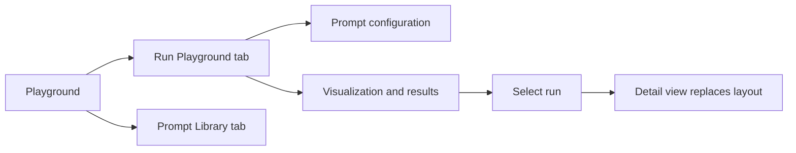
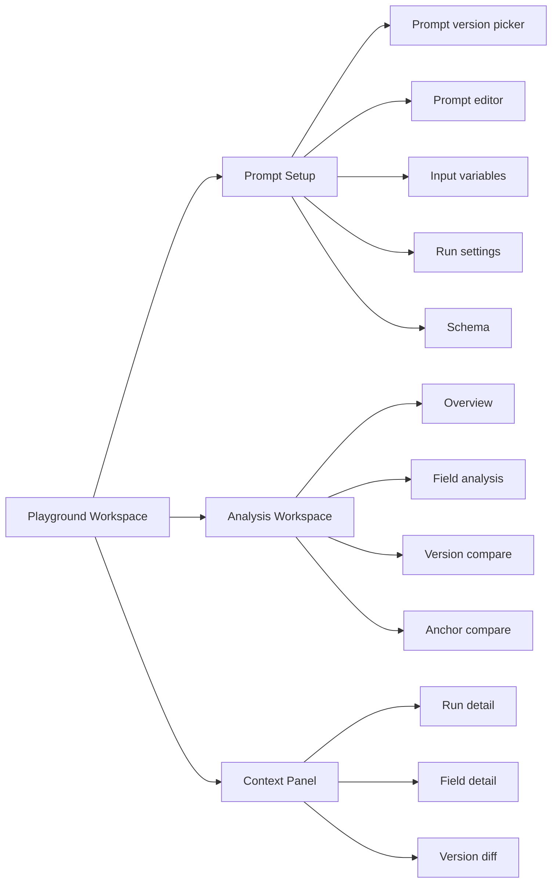
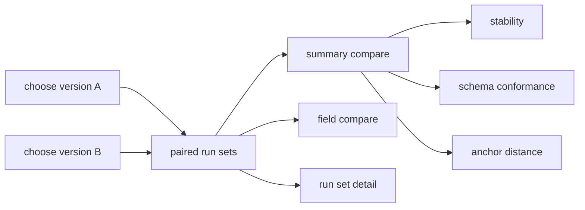
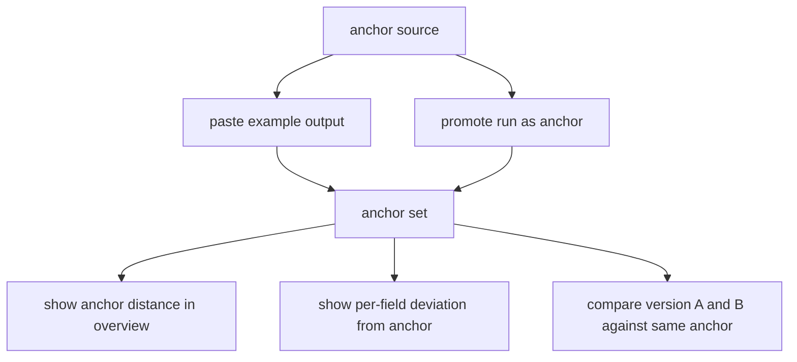

# Playground Brief

## Why this exists

Tracee is not trying to be a full observability platform for multi-agent systems.
The playground exists to support a narrower goal:

**help developers refine prompts so they can produce more consistent outputs across repeated runs**

This is both a product goal and a research goal. The playground should make it easier for developers to:

- inspect output variability
- compare prompt versions
- understand where inconsistency comes from
- move from "I have a hunch" to "I can see the pattern"

The value of the playground is not just prompt execution. Its value is in the interaction patterns it provides for understanding consistency.

## research contribution framing

The playground should support a research claim closer to this:

**developers need better interaction patterns for inspecting prompt consistency than raw logs, single-run outputs, or basic playgrounds provide**

This means the playground does not need to be feature-complete by observability standards.
It needs to be strong enough to let us study whether these interactions help developers do prompt refinement work better.

## target users and scope

Primary users:

- developers working on LLM or multi-agent prompts
- users who already iterate on prompts and inspect outputs manually
- users who care about repeatability, structured outputs, and prompt revision

Primary task context:

- repeated runs on the same input or same small input set
- prompts that often produce structured JSON outputs
- comparison of prompt revisions during active iteration

Scope note:

- free-form text is still supported, but the playground is primarily optimized for prompts with structured outputs
- JSON-first analysis should be treated as the main design center, not an edge case

## primary user need

The core user need is:

**"I ran this prompt multiple times. Did it behave consistently, where did it vary, and is this prompt version better than the last one?"**

The playground should help users answer that question quickly and with confidence.

## main user tasks

The playground should support these tasks well:

1. run one prompt multiple times and inspect the spread of outputs
2. understand variation at both the whole-output level and the per-field level
3. compare two prompt versions on the same task and see what changed
4. write and revise prompts with clear structure and low friction
5. define an "anchor" output and judge runs against it

If a feature does not support one of these tasks, it is probably out of scope for now.

## comparison unit and invariants

The main comparison unit should be a **run set**:

- one prompt version
- one input or input set
- one model configuration
- N repeated runs

Prompt version comparison should compare **two run sets**, not two isolated outputs.

For a fair comparison, these values should stay fixed unless the user is explicitly testing them:

- input variables
- run count
- provider and model
- temperature and other model settings
- output schema

If these invariants change, the UI should make that visible instead of implying the comparison is fair.

## core metrics and data contracts

The playground should avoid collapsing everything into one "best prompt" score.
It should instead present a small set of explicit comparison primitives.

Minimum primitives:

- **failure rate**: percent of runs that fail to produce usable output
- **schema conformance**: percent of runs that parse and validate against schema
- **whole-output similarity**: a run-set level view of clustering and outliers
- **field consistency**: how often a field is present, valid, and stable across runs
- **anchor distance**: distance between a run and a user-defined reference output

Working definitions:

- **consistent** means outputs in a run set cluster tightly enough on the chosen metrics for the user to trust the prompt behavior
- **unstable** means the run set shows meaningful spread, failures, or field-level disagreement that would change user interpretation or downstream behavior
- **better** means a prompt revision performs better on one or more visible metrics, not that the system computes a single authoritative winner

Implementation note:

- these metrics should be defined once and reused across overview, detail, and version comparison views

## design goals

### 1. make variability visible

Users should be able to tell at a glance whether a prompt is stable or unstable.

This includes:

- whole-run views such as clustering, outliers, and failure rate
- field-level views for structured outputs
- visibility into both distribution and exceptions

### 2. make structured output inspection easy

When outputs follow a JSON schema, users should be able to inspect how each field behaves across runs.

This includes:

- seeing which keys are usually present or missing
- seeing the distribution of values for a key
- seeing type mismatches and invalid values
- navigating from a field-level summary to concrete runs

### 3. make prompt version comparison first-class

The playground should make comparison between prompt versions a primary workflow, not a side task.

This includes:

- selecting two versions quickly
- running them on the same inputs
- viewing result sets side by side
- seeing which version is more consistent, not just which produced a nicer single output

### 4. make prompt editing feel deliberate

The editing experience should help users think clearly about prompt structure and iteration.

This does not necessarily mean a complex editor. It means the UI should support good prompt authoring habits.

### 5. support anchor-based evaluation

Users should be able to define a target or reference output and compare runs against it.

The anchor can come from:

- a user-provided example output
- a promoted run result

The anchor should act as a stable reference point in analysis views.

## non-goals

These are explicitly not the short-term goals of the playground:

- becoming a full production prompt management platform
- supporting every provider, model, and advanced inference setting
- replacing full experiment tracking systems
- solving generic MAS observability end to end
- automating prompt optimization
- ranking prompts with a single "best prompt" score
- supporting arbitrary evaluation pipelines before the core interaction model is solid

This does not mean the playground cannot help users decide which prompt is better.
It means the system should support evidence-based comparison across multiple metrics rather than outputting a single universal score.

## phased mvp boundary

### phase 1 mvp

Phase 1 should focus on one differentiator:

**multi-run consistency analysis for a single prompt version, especially for structured JSON outputs**

Phase 1 is ready when a developer can:

1. choose or create a prompt version
2. run it multiple times on the same input
3. inspect whole-output spread
4. inspect per-field consistency for structured outputs
5. navigate from aggregate patterns to concrete runs
6. decide what to revise next in the prompt

That is enough for a useful prototype and a credible user study.

### phase 2

Phase 2 should add:

- prompt version comparison
- anchor-based comparison
- stronger prompt editing support

The MVP does **not** require:

- enterprise-scale run history
- advanced collaboration
- automatic experiment reports
- broad integrations with external observability systems
- a perfect prompt editor

## feature goals by area

### multi-run overview

Current direction:

- similarity scatterplot is a good start for whole-output spread

Needed next:

- per-key distribution views for structured outputs
- summary metrics for schema conformance, missing fields, and failure counts
- interactions that let users pivot from overview to specific runs

Questions to guide design:

- what are the top 3 things a user should notice in 5 seconds?
- how do we show stability without forcing users to read every output?
- how do we prevent summary views from hiding important outliers?

### per-field structured analysis

This should become a core part of the playground when outputs are JSON.

Important interactions:

- select a key and see value distribution across runs
- identify dominant values, rare values, and null or missing cases
- compare keys across prompt versions
- click any value bucket to open the corresponding runs

Possible view patterns:

- frequency table for categorical fields
- histogram or ranges for numeric fields
- chips or grouped cards for short string values
- schema tree with aggregate badges

Success criterion:

- a user can explain how a specific field varies across runs without manually reading every JSON output

### prompt version comparison

This should support both selection and analysis.

Selection needs:

- browse existing versions
- quickly choose two versions to compare
- show version metadata and short summaries of what changed

Analysis needs:

- side-by-side run groups for version A and version B
- same input, same run count, same settings
- comparison of stability, schema conformance, and anchor distance

Success criterion:

- a user can answer "did this revision improve consistency?" without doing manual bookkeeping

Key product decision:

- comparison should be between saved run sets whenever possible, with an option to create fresh paired runs on demand

### prompt editing experience

The current component-based structure is useful, but the editing interaction likely needs more support.

Ideas to explore:

- dual views: structured components and resolved prompt preview
- inline guidance for common component roles such as role, task, constraints, and examples
- lightweight reorder and enable or disable controls
- visible variable placeholders and test values
- side-by-side diff between prompt versions
- edit with immediate awareness of which parts changed from the previous version
- save with a short rationale for the revision

Questions worth exploring:

- when does componentization help thinking, and when does it feel artificial?
- should examples be a first-class block with richer structure?
- should users edit the resolved prompt directly and map edits back to components, or is that too complex for now?
- what minimal cues would make prompt writing feel less like editing a generic form?

Design principle:

- the editor should reduce cognitive overhead, not increase it

### anchor-based comparison

The anchor is a reference output that helps users judge directional improvement.

Anchor creation modes:

- paste or author an example output
- promote an existing run to anchor

Anchor-based analysis could support:

- visualizing distance from anchor
- highlighting which fields deviate from anchor
- comparing version A vs version B against the same anchor

Important caution:

- the anchor should be treated as a user-defined reference, not ground truth
- anchor distance for JSON should be computed at the field level so users can see both overall distance and which keys drove it

Success criterion:

- a user can say "this version is closer to what I want" and point to evidence in the UI

## design principles

These should guide future playground decisions:

- favor comparisons over isolated outputs
- favor summaries that lead into evidence
- make outliers easy to find
- preserve a path from aggregate view to raw output
- support structured outputs especially well
- keep the core workflow tight: run, inspect, compare, revise
- optimize for developer sensemaking, not dashboard completeness

## playground ui diagrams

### why the current flow feels messy

The current playground likely feels messy for a few structural reasons:

- prompt library and experimentation are separated into different top-level tabs even though version selection should be part of the experiment workflow
- the layout changes too much when a run is selected, which makes the workspace feel unstable
- prompt writing, schema editing, run controls, and model settings are all stacked into one long configuration form
- result overview and detailed inspection are mixed together instead of being staged clearly

### current flow



### proposed design direction

The playground should feel like a single workspace with stable regions:

- left: prompt and experiment setup
- center: analysis workspace
- right: contextual detail panel or drawer

The structure should stay mostly stable across states. Users should not feel like panels are disappearing and reappearing in surprising ways.

### diagram 1: top-level information architecture



### diagram 2: default workspace

```text
+-----------------------------------------------------------------------------------+
| Playground                                                                        |
| [Experiment] [Library]                                             [save] [run]  |
+-----------------------------------------------------------------------------------+
| left sidebar                  | main analysis area                | context panel |
|------------------------------|-----------------------------------|---------------|
| prompt version               | empty state / overview            | help / hints  |
| - current version            |                                   |               |
| - compare with ...           | "run this prompt multiple times   |               |
|                              |  to inspect consistency"          |               |
| prompt editor                |                                   |               |
| - components                 |                                   |               |
| - resolved preview toggle    |                                   |               |
|                              |                                   |               |
| input variables              |                                   |               |
|                              |                                   |               |
| run settings                 |                                   |               |
| - provider/model             |                                   |               |
| - temperature                |                                   |               |
| - num runs                   |                                   |               |
|                              |                                   |               |
| output schema                |                                   |               |
+-----------------------------------------------------------------------------------+
```

Intent of this layout:

- keep authoring on the left and analysis in the center
- reserve the right side for contextual detail instead of making it a permanent third column full of primary content
- let users stay oriented even before any results exist

### diagram 3: after running a prompt

```text
+-----------------------------------------------------------------------------------+
| Playground                                                                        |
| [Experiment] [Library]                                      run set: v12 / 8 runs |
+-----------------------------------------------------------------------------------+
| left sidebar                  | main analysis area                | context panel |
|------------------------------|-----------------------------------|---------------|
| prompt version               | top summary                        | selected run  |
| input variables              | - pass/fail counts                | or field info |
| run settings                 | - schema conformance              |               |
| schema                       | - variability score               |               |
|                              |                                   |               |
| [run again]                  | tabs                              |               |
| [save version]               | [overview] [fields] [runs]        |               |
|                              |                                   |               |
|                              | overview tab                      |               |
|                              | - scatterplot                     |               |
|                              | - outlier badges                  |               |
|                              | - failure summary                 |               |
|                              |                                   |               |
|                              | below                             |               |
|                              | - run cards                       |               |
+-----------------------------------------------------------------------------------+
```

Intent of this layout:

- overview is the default landing state after execution
- results are grouped into tabs, which reduces the feeling of everything being on screen at once
- prompt setup stays visible so revision remains easy

### diagram 4: field-level analysis view

```text
+-----------------------------------------------------------------------------------+
| analysis tabs: [overview] [fields] [runs]                                         |
+-----------------------------------------------------------------------------------+
| field list / schema tree      | field distribution view           | context panel |
|------------------------------|-----------------------------------|---------------|
| product_name                 | field: blocker_count              | selected runs |
| owner                        |                                   | with this     |
| launch_date                  | distribution                      | value         |
| approval_required            | 0: 2 runs                         |               |
| blocker_count   <- selected  | 1: 1 run                          | or            |
| is_blocked                   | 2: 4 runs                         | field notes   |
| is_high_risk                 | 3+: 1 run                         |               |
|                              |                                   |               |
| badges                       | quality indicators                |               |
| - missing in 1 run           | - missing: 0                      |               |
| - type mismatch: 0           | - invalid: 0                      |               |
| - most common: 2             | - spread: medium                  |               |
+-----------------------------------------------------------------------------------+
```

Intent of this layout:

- the field list becomes the navigation model
- the center shows the distribution for the selected key
- the right panel shows concrete runs behind any bucket or anomaly

### diagram 5: run detail as a drawer, not a new page state

```text
+-----------------------------------------------------------------------------------+
| left sidebar                  | main analysis area                | run detail    |
|------------------------------|-----------------------------------|---------------|
| prompt version               | scatterplot / field table         | Run 4         |
| input variables              | run cards                         | status badge  |
| run settings                 |                                   | latency/tokens|
| schema                       |                                   |               |
|                              |                                   | tabs          |
|                              |                                   | [tree] [raw]  |
|                              |                                   | [diff vs ref] |
|                              |                                   |               |
|                              |                                   | output content|
+-----------------------------------------------------------------------------------+
```

Intent of this layout:

- selecting a run should not replace the prompt form
- details should feel inspectable and dismissible
- this preserves continuity between overview and detail

### diagram 6: version comparison workspace



```text
+-----------------------------------------------------------------------------------+
| Compare Prompt Versions                                                           |
+-----------------------------------------------------------------------------------+
| left compare setup             | main comparison area              | context panel |
|-------------------------------|-----------------------------------|---------------|
| version A picker              | top summary                        | selected field|
| version B picker              | - stability A vs B                | or run set    |
| shared input variables        | - conformance A vs B              |               |
| shared run settings           | - failures A vs B                 |               |
| [run paired experiment]       |                                   |               |
|                               | tabs                              |               |
|                               | [overview] [fields] [diff]        |               |
|                               |                                   |               |
|                               | side-by-side charts/tables        |               |
+-----------------------------------------------------------------------------------+
```

Intent of this layout:

- comparison is its own dedicated mode, not something squeezed into the single-version screen
- version selection, shared settings, and result comparison live together

### diagram 7: anchor workflow



### recommended layout states

Phase 1 should probably have only 4 stable states:

1. setup empty state
2. single-version results overview
3. field analysis
4. run detail drawer

Phase 2 can add:

1. version comparison workspace
2. anchor-based comparison
3. stronger prompt library and version browsing

### component map for the proposed ui

Left sidebar:

- prompt version picker
- prompt editor
- resolved prompt preview
- input variables
- run settings
- schema

Main area:

- summary strip
- overview tab
- fields tab
- runs tab
- compare tab later

Right context panel:

- run detail
- field detail
- version diff
- anchor details

### layout rules for future iterations

- keep the main workspace structure stable across states
- use tabs inside the analysis area instead of stacking every visualization on one page
- treat detail as a drawer or side panel, not as a layout replacement
- integrate prompt library and version selection into the experiment workflow
- separate authoring controls from analysis views

## what to build next

### now

- define the analysis model for per-key JSON distribution
- define the core metrics once and reuse them everywhere
- define the run-set data model and comparison invariants
- refine the prompt editor workflow before adding more advanced controls

### soon

- implement a strong phase 1 workflow before broadening scope
- implement per-field aggregate views
- implement version pair selection and side-by-side comparison
- implement anchor creation and anchor promotion from runs
- add prompt version diff and resolved prompt preview

### later

- richer eval workflows
- reusable experiment templates
- team workflows and collaboration features
- more advanced scoring and automated analysis

## open questions

- what kinds of JSON fields should get specialized visualizations first?
- what exact backend object should represent a saved run set or experiment?
- should version comparison run both prompts at the same time or compare previously saved result sets?
- should anchors be one per prompt, one per comparison session, or many?
- how should we explain consistency when there is no output schema?
- what is the smallest editor change that would most improve prompt authoring quality?

## working definition of success

The playground is succeeding if users can:

- notice instability quickly
- explain where outputs differ
- compare revisions with confidence
- use anchors to reason about desired behavior
- leave the session knowing what to change next in the prompt

If users still have to manually inspect raw outputs for most of these tasks, the playground is not yet doing enough.
